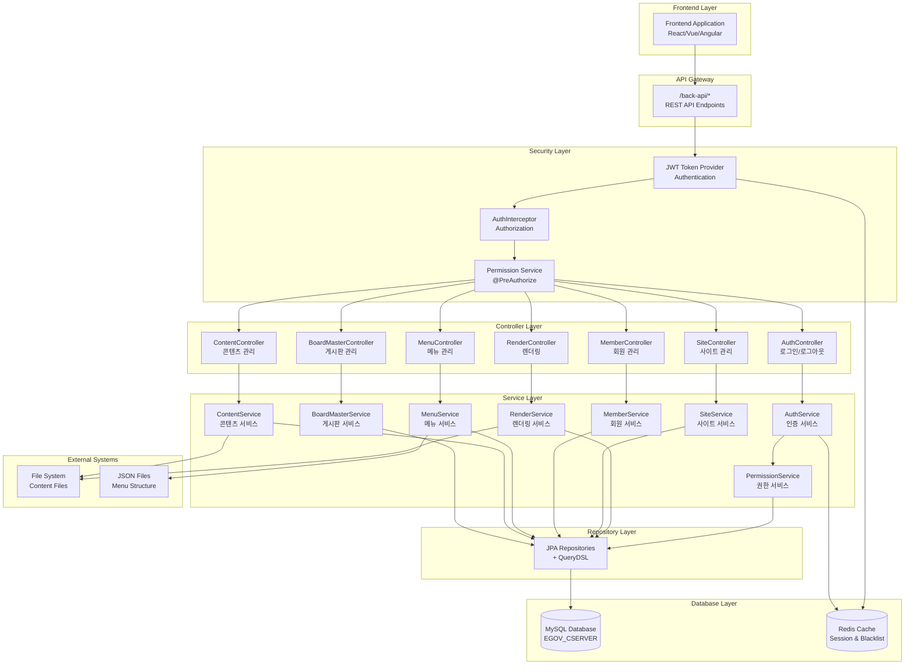

## 🔧 주요 비즈니스 로직

### 1. 전체 시스템 아키텍처

```mermaid
graph TB
    subgraph "Frontend Layer"
        FE[Frontend Application<br/>React/Vue/Angular]
    end
    
    subgraph "API Gateway"
        API["/back-api/*<br/>REST API Endpoints"]
    end
    
    subgraph "Security Layer"
        JWT[JWT Token Provider<br/>Authentication]
        AUTH[AuthInterceptor<br/>Authorization]
        PERM[Permission Service<br/>@PreAuthorize]
    end
    
    subgraph "Controller Layer"
        AC[AuthController<br/>로그인/로그아웃]
        BMC[BoardMasterController<br/>게시판 관리]
        CC[ContentController<br/>콘텐츠 관리]
        MC[MenuController<br/>메뉴 관리]
        MEC[MemberController<br/>회원 관리]
        SC[SiteController<br/>사이트 관리]
        RC[RenderController<br/>렌더링]
    end
    
    subgraph "Service Layer"
        AS[AuthService<br/>인증 서비스]
        BMS[BoardMasterService<br/>게시판 서비스]
        CS[ContentService<br/>콘텐츠 서비스]
        MS[MenuService<br/>메뉴 서비스]
        MES[MemberService<br/>회원 서비스]
        SS[SiteService<br/>사이트 서비스]
        RS[RenderService<br/>렌더링 서비스]
        PS[PermissionService<br/>권한 서비스]
    end
    
    subgraph "Repository Layer"
        REPO[JPA Repositories<br/>+ QueryDSL]
    end
    
    subgraph "Database Layer"
        DB[(MySQL Database<br/>EGOV_CSERVER)]
        REDIS[(Redis Cache<br/>Session & Blacklist)]
    end
    
    subgraph "External Systems"
        FILE[File System<br/>Content Files]
        JSON[JSON Files<br/>Menu Structure]
    end
    
    FE --> API
    API --> JWT
    JWT --> AUTH
    AUTH --> PERM
    PERM --> AC
    PERM --> BMC
    PERM --> CC
    PERM --> MC
    PERM --> MEC
    PERM --> SC
    PERM --> RC
    
    AC --> AS
    BMC --> BMS
    CC --> CS
    MC --> MS
    MEC --> MES
    SC --> SS
    RC --> RS
    
    AS --> PS
    BMS --> REPO
    CS --> REPO
    MS --> REPO
    MES --> REPO
    SS --> REPO
    RS --> REPO
    PS --> REPO
    
    REPO --> DB
    AS --> REDIS
    JWT --> REDIS
    
    CS --> FILE
    MS --> JSON
    RS --> FILE
```