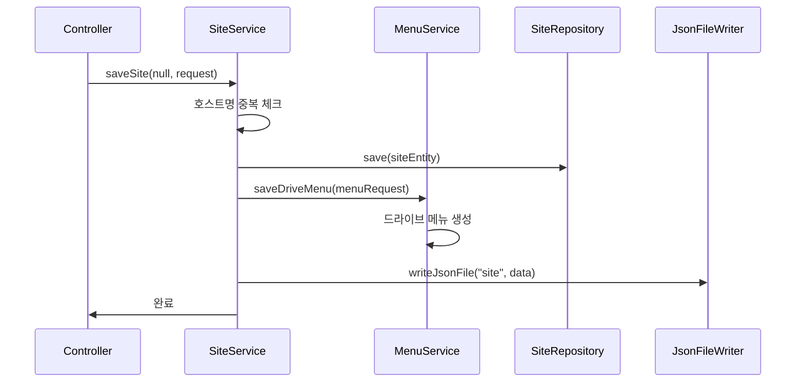
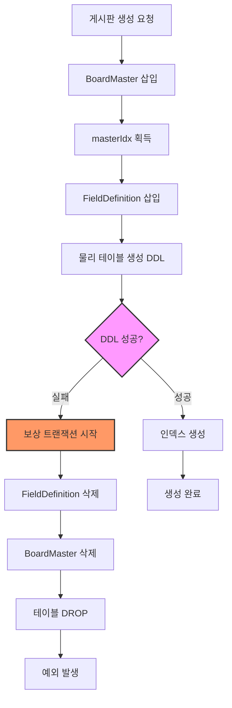
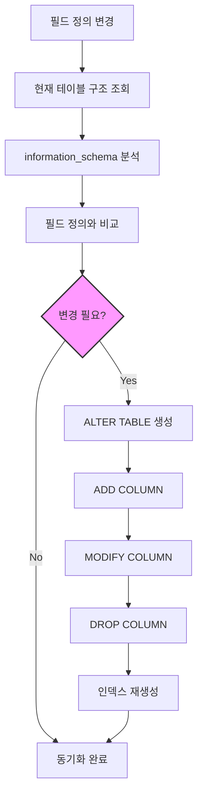
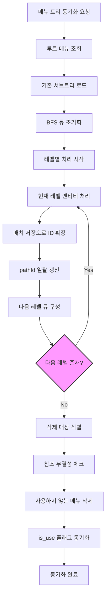
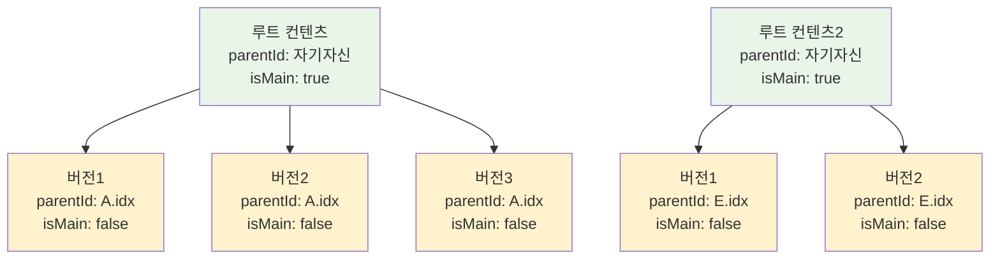
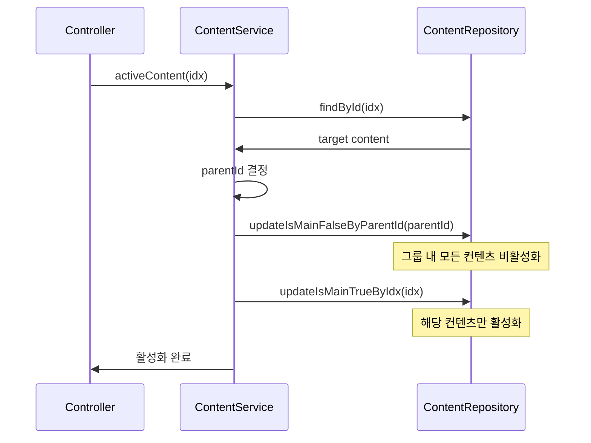
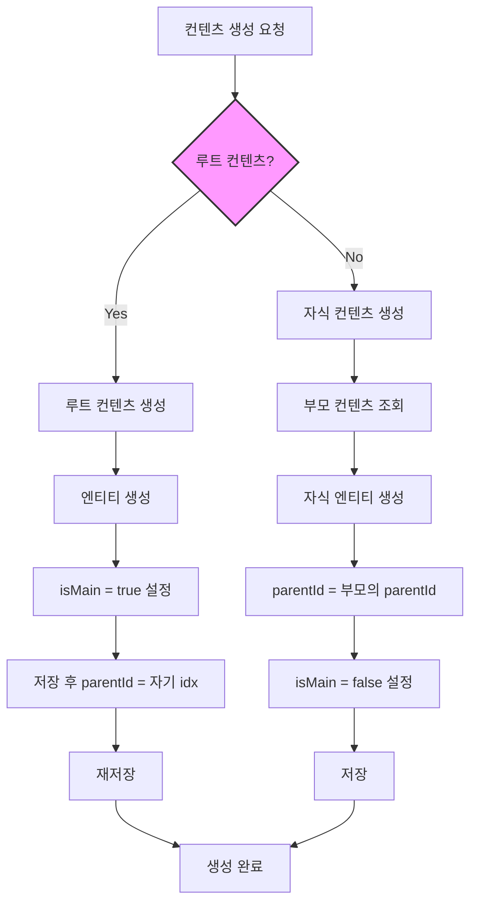

# CMS 비즈니스 로직 분석 보고서

## 개요

본 보고서는 전자정부 프레임워크 기반 CMS 시스템의 핵심 비즈니스 로직을 분석한 결과를 담고 있습니다. 사이트 관리, 게시판 관리, 메뉴 관리, 컨텐츠 관리의 4가지 핵심 기능을 중심으로 구현 방식을 분석하고, 잘된 점과 개선점을 도출했습니다.

## 1. 핵심 기능 분석

### 1.1 사이트 관리 (Site Management)

#### 구현 방식
- **엔티티**: `Site` 엔티티로 사이트 정보 관리 (hostname, domain, IP 제어 등)
- **소프트 삭제**: `isDeleted` 플래그를 통한 논리 삭제 지원
- **메뉴 연동**: 사이트 생성/수정 시 자동으로 드라이브 메뉴 생성/수정
- **JSON 파일 동기화**: 모든 변경사항을 JSON 파일로 백업
- **IP 접근 제어**: `allowIp`, `denyIp` 필드를 통한 화이트리스트/블랙리스트 관리

#### 사이트 생성 플로우



#### 사이트 생성 핵심 코드
```java
@Override
@Transactional(rollbackFor = EgovBizException.class)
public void saveSite(String siteHostName, SiteRequest request) throws Exception {
    boolean isNew = (siteHostName == null);
    String domain = request.getSiteDomain();
    String newHostName = domain != null && domain.contains(".")
            ? domain.substring(0, domain.indexOf("."))
            : domain;

    if (isNew) {
        // 1. 중복 체크
        if (siteRepository.existsBySiteHostName(newHostName)) {
            throw processException("이미 존재하는 호스트명입니다: " + newHostName);
        }

        // 2. 사이트 엔티티 저장
        Site entity = siteMapper.toEntity(request);
        entity.setSiteHostName(newHostName);
        siteRepository.save(entity);

        // 3. 자동 드라이브 메뉴 생성
        MenuRequest menuRequest = MenuRequest.builder()
                .type("drive")
                .level(1)
                .name(newHostName)
                .title(request.getSiteName())
                .pathUrl(domain + "|")
                .pathString(request.getSiteName())
                .isShow(true)
                .position(0)
                .build();
        menuService.saveDriveMenu(null, menuRequest);

        // 4. JSON 백업
        jsonFileWriterUtil.writeJsonFile("site", "site_list", 
                siteRepository.findAll(), false);
    }
}
```

#### IP 접근 제어 로직
```java
// Site 엔티티의 IP 제어 필드
@Column(name = "allow_ip", columnDefinition = "TEXT")
private String allowIp;  // 허용 IP 목록 (CSV)

@Column(name = "deny_ip", columnDefinition = "TEXT")  
private String denyIp;   // 차단 IP 목록 (CSV)
```

### 1.2 게시판 관리 (Board Management)

#### 구현 방식
- **동적 게시판**: 런타임에 테이블 생성/수정이 가능한 유연한 구조
- **메타데이터 관리**: `BoardMaster`와 `BoardFieldDefinition`으로 게시판 스키마 정의
- **DDL 자동화**: 필드 정의 변경 시 자동으로 물리 테이블 구조 동기화
- **보상 트랜잭션**: DDL 실패 시 이전 상태로 복구하는 보상 로직 구현

#### 동적 게시판 생성 플로우



#### 게시판 생성 핵심 코드
```java
@Override
@Transactional(rollbackFor = EgovBizException.class)
public void createBoard(BoardCreateRequest request) throws Exception {
    final String boardId = request.getMaster().getBoardId();
    Long masterIdx = null;
    
    try {
        // 1) BoardMaster 삽입 → idx 반환
        masterIdx = boardMasterDao.insertBoardMasterReturningIdx(request.getMaster());

        // 2) 필드 정의 삽입
        boardMasterDao.insertBoardFieldDefinitions(masterIdx, request.getFields());

        // 3) 물리 테이블 생성 (DDL; MySQL/Maria는 암묵커밋)
        boardMasterDao.createBoardTable(boardId);

        loggingUtil.logSuccess(Action.CREATE, "게시판 생성 완료: " + boardId);
        
    } catch (Exception e) {
        // === 보상 롤백(DDL 실패 시 논리 데이터 복구) ===
        try {
            if (masterIdx != null) {
                boardMasterDao.deleteBoardFieldDefinitions(masterIdx);
                boardMasterDao.deleteBoardMaster(masterIdx);
            }
            boardMasterDao.safeDropBoardTable(boardId);
        } catch (Exception comp) {
            loggingUtil.logFail(Action.CREATE, "보상 롤백 실패: " + comp.getMessage());
        }
        throw processException("게시판 생성 중 오류가 발생했습니다.", e);
    }
}
```

#### DDL 생성 로직
```java
// 동적 테이블 DDL 생성
private String buildCreateTableDDL(String table, List<FieldDef> defs) throws Exception {
    // 1) 시스템 컬럼 (고정)
    List<String> baseCols = SYSTEM_COLS.entrySet().stream()
            .map(e -> e.getKey() + " " + e.getValue())
            .collect(Collectors.toList());

    // 2) 동적 컬럼 (사용자 정의)
    List<String> dynCols = new ArrayList<>();
    for (FieldDef f : sorted) {
        if (RESERVED.contains(f.fieldName)) {
            throw new EgovBizException("시스템 컬럼명 사용 금지: " + f.fieldName);
        }
        dynCols.add(toColumnDDL(f));
    }

    return "CREATE TABLE " + table + " (\n  " +
            String.join(",\n  ", concat(baseCols, dynCols)) +
            "\n) ENGINE=InnoDB DEFAULT CHARSET=utf8mb4;";
}
```

#### 스키마 동기화 플로우



#### 스키마 동기화 코드
```java
// 물리 테이블과 정의 동기화
public void syncPhysicalTableWithDefinitions(Long masterIdx) throws Exception {
    String boardId = findBoardIdByIdx(masterIdx);
    String table = tableName(boardId);
    
    // 1) 현재 필드 정의 로드
    List<FieldDef> defs = loadFieldDefs(masterIdx);
    
    // 2) 실제 테이블 컬럼 정보 조회 (information_schema)
    Map<String, ColumnInfo> actualCols = loadActualColumns(table);
    
    // 3) 차이점 분석 후 ALTER TABLE 실행
    List<String> alterStatements = buildAlterStatements(defs, actualCols);
    
    for (String sql : alterStatements) {
        jdbc.getJdbcTemplate().execute(sql);
    }
}
```

### 1.3 메뉴 관리 (Menu Management)

#### 구현 방식
- **계층 구조**: `parentId`와 `pathId`를 활용한 트리 구조 관리
- **BFS 기반 동기화**: 레벨별 처리로 트리 일관성 보장
- **pathId 캐싱**: 부모-자식 관계의 pathId를 캐시하여 성능 최적화
- **참조 무결성**: 메뉴-게시판, 메뉴-컨텐츠 간 참조 관계 관리

#### 메뉴 트리 구조

```mermaid
graph TD
    A[드라이브 메뉴<br/>pathId: "1"] --> B[메뉴1<br/>pathId: "1.2"]
    A --> C[메뉴2<br/>pathId: "1.3"]
    A --> D[메뉴3<br/>pathId: "1.4"]
    B --> E[서브메뉴1<br/>pathId: "1.2.5"]
    B --> F[서브메뉴2<br/>pathId: "1.2.6"]
    C --> G[서브메뉴3<br/>pathId: "1.3.7"]
    
    style A fill:#e1f5fe
    style B fill:#f3e5f5
    style C fill:#f3e5f5
    style D fill:#f3e5f5
```

#### 메뉴 트리 동기화 플로우



#### BFS 기반 트리 동기화 코드
```java
@Override
@Transactional(rollbackFor = EgovBizException.class)
public void syncMenuTree(String driveName, List<MenuRequest> newTree) throws Exception {
    // 1) 루트 조회
    Menu rootMenu = menuRepository.findByNameAndType(driveName, "drive")
            .orElseThrow(() -> processException("Drive not found: " + driveName));
    final Long rootId = rootMenu.getId();
    final String rootPathId = rootMenu.getPathId();

    // 2) 기존 서브트리 로드
    List<Menu> existingMenus = menuRepository.findAllDescendantsByPathId(rootPathId);
    Map<Long, Menu> existingById = existingMenus.stream()
            .collect(Collectors.toMap(Menu::getId, m -> m));

    // 3) BFS 큐 초기화
    record LevelItem(MenuRequest dto, Long parentId) {}
    List<LevelItem> current = new ArrayList<>();
    if (newTree != null) {
        for (MenuRequest child : newTree) {
            current.add(new LevelItem(child, rootId));
        }
    }

    // 4) pathId 캐시
    Map<Long, String> pathCache = new HashMap<>();
    pathCache.put(rootId, rootPathId);

    // 5) 레벨별 BFS 처리
    while (!current.isEmpty()) {
        // 5-1) 현재 레벨 엔티티 생성/수정
        List<Menu> toPersist = new ArrayList<>(current.size());
        for (LevelItem item : current) {
            MenuRequest dto = item.dto();
            Long parentId = item.parentId();

            boolean isExisting = dto.getId() != null && existingById.containsKey(dto.getId());
            Menu entity = isExisting ? 
                    updateExistingMenu(existingById.get(dto.getId()), dto, parentId) :
                    createNewMenu(dto, parentId);
            
            toPersist.add(entity);
        }

        // 5-2) 배치 저장으로 ID 확정
        menuRepository.saveAll(toPersist);

        // 5-3) pathId 일괄 갱신
        Map<Long, List<Menu>> byParent = toPersist.stream()
                .collect(Collectors.groupingBy(Menu::getParentId));

        for (Map.Entry<Long, List<Menu>> entry : byParent.entrySet()) {
            Long parentId = entry.getKey();
            String parentPathId = pathCache.get(parentId);
            
            // 부모의 모든 자식 pathId를 한 번에 갱신
            menuRepository.updateChildrenPathIds(parentId, parentPathId);
            
            // 캐시 갱신
            for (Menu child : entry.getValue()) {
                String childPath = parentPathId + "." + child.getId();
                pathCache.put(child.getId(), childPath);
            }
        }

        // 5-4) 다음 레벨 큐 구성
        current = buildNextLevelQueue(current, toPersist);
    }
}
```

#### pathId 갱신 SQL
```java
// 부모의 모든 자식들의 pathId를 일괄 갱신
@Modifying
@Query("UPDATE Menu m SET m.pathId = CONCAT(:parentPathId, '.', m.id) WHERE m.parentId = :parentId")
void updateChildrenPathIds(@Param("parentId") Long parentId, 
                          @Param("parentPathId") String parentPathId);
```

### 1.4 컨텐츠 관리 (Content Management)

#### 구현 방식
- **그룹 기반 관리**: `parentId`를 통한 컨텐츠 그룹화
- **버전 관리**: `isMain` 플래그로 활성 버전 관리
- **호스트별 분리**: `hostname` 필드로 사이트별 컨텐츠 격리
- **계층 구조**: 루트-자식 관계의 컨텐츠 구조

#### 컨텐츠 그룹 구조



#### 컨텐츠 활성화 플로우



#### 컨텐츠 활성화 핵심 코드
```java
@Override
@Transactional(rollbackFor = EgovBizException.class)
public void activeContent(Long idx) throws Exception {
    try {
        // 1) 대상 컨텐츠 조회 (parentId 획득)
        Content target = contentRepository.findById(idx)
                .orElseThrow(() -> new IllegalArgumentException("Content not found: " + idx));

        Long parentId = target.getParentId() != null ? target.getParentId() : target.getIdx();

        // 2) 해당 그룹 전체를 비활성화 (isMain = false)
        contentRepository.updateIsMainFalseByParentId(parentId);

        // 3) 현재 컨텐츠만 활성화 (isMain = true)
        contentRepository.updateIsMainTrueByIdx(idx);

        loggingUtil.logSuccess(Action.UPDATE, 
                "Content activated: idx=" + idx + ", parentId=" + parentId);
                
    } catch (Exception e) {
        loggingUtil.logFail(Action.UPDATE, "Activation failed: " + e.getMessage());
        throw processException("Failed to activate content", e);
    }
}
```

#### 컨텐츠 생성 플로우



#### 루트 컨텐츠 생성 코드
```java
@Override
@Transactional(rollbackFor = EgovBizException.class)
public void createRootContent(ContentRequest request) throws Exception {
    try {
        JwtAuthenticatedUser user = SecurityUtil.getCurrentUser();

        // 1) 엔티티 생성
        Content root = contentMapper.toEntity(request);
        root.setCreatedBy(user.userId());
        root.setIsMain(true);  // 루트는 항상 활성

        // 2) 1차 저장 (ID 확정)
        Content saved = contentRepository.save(root);
        
        // 3) parentId를 자기 자신으로 설정 후 재저장
        saved.setParentId(saved.getIdx());
        contentRepository.save(saved);

        loggingUtil.logSuccess(Action.CREATE, "Root content created: " + saved.getIdx());
        
    } catch (Exception e) {
        loggingUtil.logFail(Action.CREATE, "Root content creation failed: " + e.getMessage());
        throw processException("Failed to create root content", e);
    }
}
```

#### 호스트별 컨텐츠 동기화 코드
```java
// 사용 중인 컨텐츠 플래그 동기화 (호스트별)
@Override
@Transactional(rollbackFor = EgovBizException.class)
public void syncUsageFlagsByContentIds(Set<String> inUseContentIds) throws Exception {
    // 1) 유효한 ID만 필터링
    Set<Long> ids = inUseContentIds.stream()
            .filter(Objects::nonNull)
            .map(String::trim)
            .filter(s -> s.matches("\\d+"))
            .map(Long::parseLong)
            .collect(Collectors.toCollection(LinkedHashSet::new));

    // 2) 컨텐츠 조회 및 호스트별 그룹화
    List<Content> selected = contentRepository.findByIdxIn(ids);
    Map<String, Set<Long>> hostToParentIds = selected.stream()
            .filter(c -> c.getParentId() != null)
            .collect(Collectors.groupingBy(
                    Content::getHostname,
                    Collectors.mapping(Content::getParentId, 
                                     Collectors.toCollection(LinkedHashSet::new))
            ));

    // 3) 호스트별 is_use 플래그 동기화
    for (Map.Entry<String, Set<Long>> entry : hostToParentIds.entrySet()) {
        String hostname = entry.getKey();
        Set<Long> parentIds = entry.getValue();
        
        // 사용 중인 컨텐츠 활성화
        contentRepository.updateIsUseTrueByHostnameAndParentIdIn(hostname, parentIds);
        
        // 사용하지 않는 컨텐츠 비활성화
        contentRepository.updateIsUseFalseByHostnameAndParentIdNotIn(hostname, parentIds);
    }
}
```
