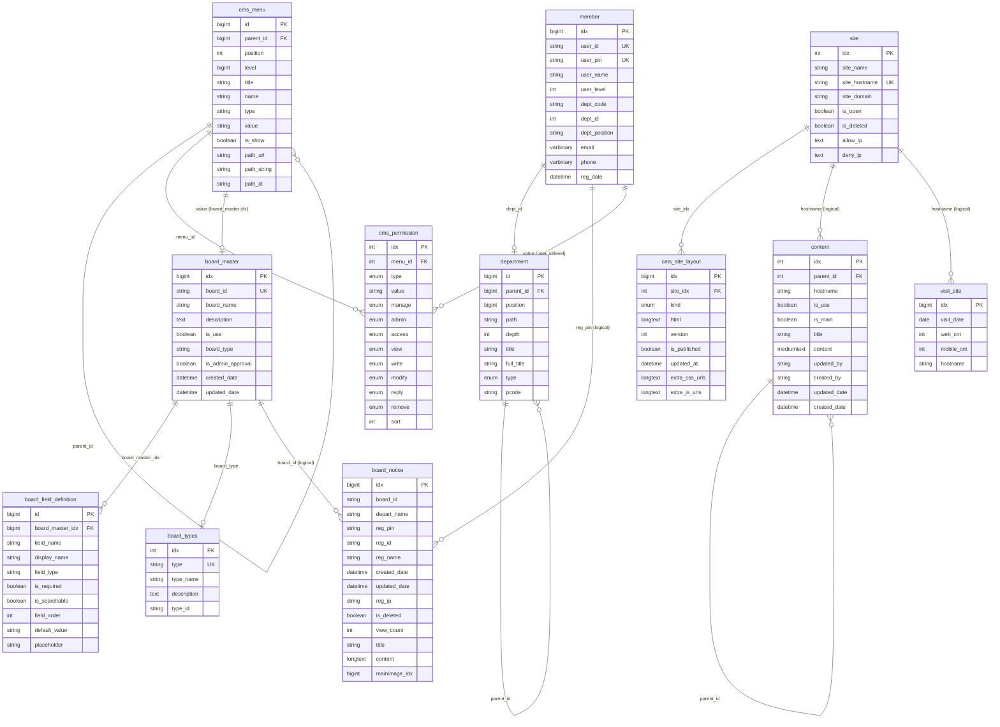
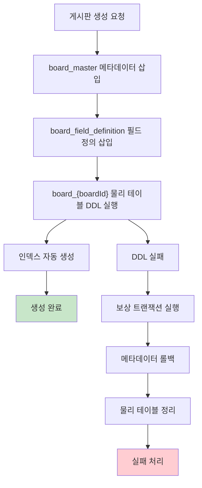
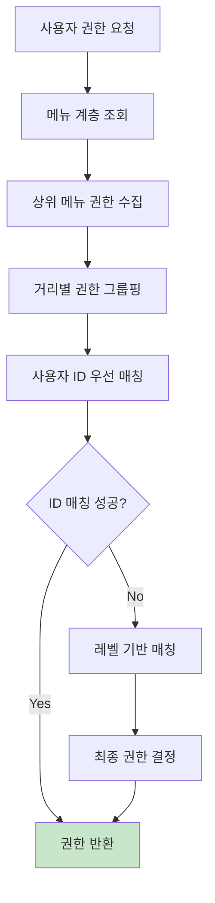

# 데이터베이스 구조 분석 문서

## 📋 개요

이 문서는 전자정부 CMS 백엔드 시스템의 데이터베이스 구조와 테이블 간 연관관계를 분석한 결과를 정리합니다.

## 🏗️ 전체 시스템 아키텍처

### 시스템 특징
- **동적 게시판 시스템**: 런타임에 게시판 테이블 생성/수정 가능
- **다중 사이트 지원**: hostname 기반 사이트 분리
- **계층형 구조**: 부서, 메뉴, 콘텐츠의 트리 구조 지원
- **세분화된 권한 관리**: 메뉴별 사용자/레벨 권한 제어
- **Soft Reference 패턴**: 물리적 FK 최소화, 논리적 참조 활용

## 📊 주요 테이블 그룹

### 1. 사용자 및 조직 관리
- `member`: 사용자 정보 (개인정보 암호화 적용)
- `department`: 조직도/부서 정보 (트리 구조)

### 2. 사이트 및 메뉴 시스템
- `site`: 다중 사이트 정보
- `cms_site_layout`: 사이트별 레이아웃 관리
- `cms_menu`: 메뉴 구조 (트리 구조)
- `cms_permission`: 메뉴별 권한 관리

### 3. 게시판 시스템
- `board_master`: 게시판 메타데이터
- `board_field_definition`: 게시판별 커스텀 필드 정의
- `board_types`: 게시판 타입 정의
- `board_*`: 동적 생성되는 게시판 테이블들 (30+ 개)

### 4. 콘텐츠 및 통계
- `content`: 정적 콘텐츠 관리 (계층형)
- `visit_site`: 사이트별 방문자 통계

## 🔗 테이블 연관관계 다이어그램



## 🔑 연관관계 상세 분석

### A. 물리적 외래키 관계 (실제 FK 제약조건)

| 자식 테이블 | 부모 테이블 | 외래키 필드 | 참조 필드 |
|------------|------------|------------|----------|
| `cms_site_layout` | `site` | `site_idx` | `idx` |
| `board_field_definition` | `board_master` | `board_master_idx` | `idx` |

### B. 논리적 참조 관계 (애플리케이션 레벨)

| 참조하는 테이블 | 참조되는 테이블 | 연결 필드 | 연결 방식 | 설명 |
|----------------|----------------|-----------|----------|------|
| **member** | **department** | `dept_id` → `id` | 직접 참조 | 부서 소속 |
| **cms_menu** | **cms_menu** | `parent_id` → `id` | 자기 참조 | 트리 구조 |
| **cms_menu** | **board_master** | `value` → `idx` (CAST) | 타입별 연결 | 메뉴-게시판 연결 |
| **cms_permission** | **cms_menu** | `menu_id` → `id` | 직접 참조 | 메뉴별 권한 |
| **cms_permission** | **member** | `value` → `user_id/user_level` | 조건부 참조 | 사용자/레벨 권한 |
| **board_\*** | **member** | `reg_pin` → `user_pin` | 직접 참조 | 게시글 작성자 |
| **board_\*** | **department** | `depart_name` → `title` | 이름 기반 | 게시글 부서 |
| **content** | **content** | `parent_id` → `idx` | 자기 참조 | 계층형 콘텐츠 |
| **content** | **site** | `hostname` → `site_hostname` | 이름 기반 | 사이트별 콘텐츠 |
| **visit_site** | **site** | `hostname` → `site_hostname` | 이름 기반 | 사이트별 방문통계 |

### C. 동적 관계 (런타임 생성)

#### 1. 동적 게시판 테이블 생성 규칙
```java
// BoardMasterDaoImpl.tableName()
board_master.board_id = "notice" → board_notice 테이블
board_master.board_id = "news" → board_news 테이블
board_master.board_id = "photo" → board_photo 테이블
```

#### 2. 메뉴 타입별 연결 로직
```java
// DynamicBoardDaoImpl.resolveBoardIdByMenuId()
cms_menu.type = 'board' AND cms_menu.value = board_master.idx (CAST)
cms_menu.type = 'content' → content 테이블 연결
cms_menu.type = 'drive' → 사이트 루트 메뉴
```

## 🎯 핵심 설계 패턴

### 1. Soft Reference Pattern
- **특징**: 물리적 FK 대신 논리적 참조 사용
- **장점**: 동적 테이블 생성 시 제약조건 회피, 확장성 확보
- **단점**: 참조 무결성을 애플리케이션에서 보장해야 함

### 2. Multi-Tenancy Pattern
- **사이트별 분리**: `hostname` 기반 데이터 격리
- **부서별 분리**: `depart_name` 기반 데이터 분류
- **권한별 분리**: 사용자 레벨/ID 기반 접근 제어

### 3. Dynamic Schema Pattern
- **런타임 테이블 생성**: `board_master` 기반 동적 DDL 실행
- **메타데이터 관리**: `board_field_definition`으로 스키마 정의
- **보상 트랜잭션**: DDL 실패 시 자동 롤백 처리

### 4. Tree Structure Pattern
- **계층 구조 지원**: `parent_id`, `level`, `path` 조합
- **적용 테이블**: department, cms_menu, content
- **BFS 기반 동기화**: 레벨별 처리로 일관성 보장

## 📈 동적 게시판 시스템 상세

### 게시판 생성 프로세스


### 공통 게시판 필드 구조
```sql
-- 모든 board_* 테이블의 공통 필드
idx               BIGINT AUTO_INCREMENT PRIMARY KEY
board_id          VARCHAR(50) -- 게시판 식별자
depart_name       VARCHAR(250) -- 부서명
reg_pin           VARCHAR(250) -- 등록자 PIN (member.user_pin)
reg_id            VARCHAR(250) -- 등록자 ID (member.user_id)
reg_name          VARCHAR(30) -- 등록자 이름
created_date      DATETIME -- 등록일
updated_date      DATETIME -- 수정일
reg_ip            VARCHAR(15) -- 등록자 IP
is_deleted        TINYINT(1) DEFAULT 0 -- 소프트 삭제
view_count        INT DEFAULT 0 -- 조회수
is_top_fixed      TINYINT(1) DEFAULT 0 -- 상단 고정
pidx              INT UNSIGNED DEFAULT 0 -- 상위 게시글 (답글)
level             INT UNSIGNED DEFAULT 0 -- 답글 레벨
seq               TINYINT UNSIGNED DEFAULT 0 -- 정렬 순서
category_1        VARCHAR(50) -- 카테고리1
category_2        VARCHAR(50) -- 카테고리2
process_1         VARCHAR(50) -- 처리 구분
title             VARCHAR(255) -- 제목
content           LONGTEXT -- 내용
mainimage_idx     BIGINT -- 대표 이미지
period_start      VARCHAR(10) -- 게시 시작일
period_end        VARCHAR(10) -- 게시 종료일
contents_original LONGTEXT -- 원본 콘텐츠
```

## 🔒 권한 시스템 구조

### 권한 해결 플로우


### 권한 타입별 매핑
- **ID 기반**: `cms_permission.value` = `member.user_id`
- **레벨 기반**: `cms_permission.value` = `member.user_level` (문자열)
- **권한 종류**: access, view, write, modify, reply, remove
- **우선순위**: 사용자 ID > 사용자 레벨 > 상위 메뉴 권한

## 🚀 성능 최적화 권장사항

### 1. 인덱스 최적화
```sql
-- 게시판 테이블 권장 인덱스
CREATE INDEX idx_board_posts_board_id_created ON board_*(board_id, created_date);
CREATE INDEX idx_board_posts_reg_pin ON board_*(reg_pin);
CREATE INDEX idx_board_posts_category ON board_*(category_1, category_2);
CREATE INDEX idx_board_posts_is_deleted_created ON board_*(is_deleted, created_date);

-- 메뉴-게시판 연결 최적화
CREATE INDEX idx_cms_menu_type_value ON cms_menu(type, value);

-- 권한 시스템 최적화
CREATE INDEX idx_cms_permission_menu_type_value ON cms_permission(menu_id, type, value);
```

### 2. 파티셔닝 고려사항
```sql
-- 대용량 게시판 테이블 파티셔닝 예시
ALTER TABLE board_notice PARTITION BY RANGE (YEAR(created_date)) (
    PARTITION p2023 VALUES LESS THAN (2024),
    PARTITION p2024 VALUES LESS THAN (2025),
    PARTITION p2025 VALUES LESS THAN (2026)
);
```

### 3. 아카이빙 전략
- 오래된 게시글 → `board_*_archive` 테이블 이동
- 방문자 통계 → 월별/연도별 집계 테이블 생성
- 로그 데이터 → 별도 로그 DB 분리
